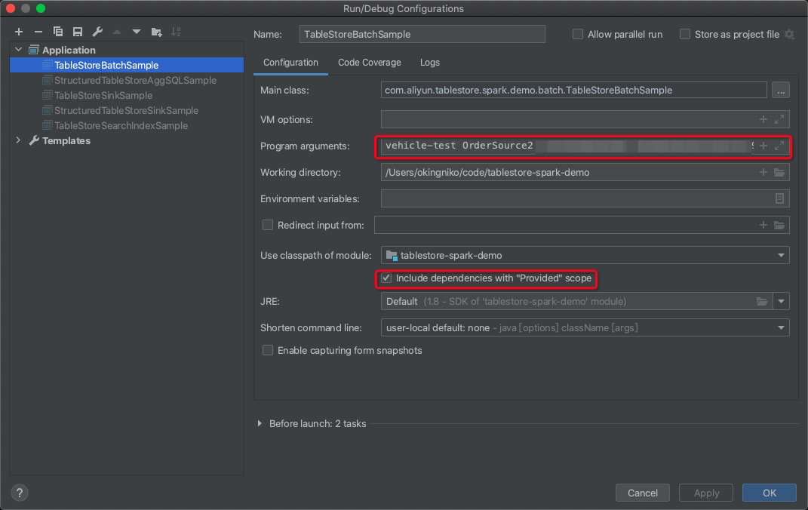
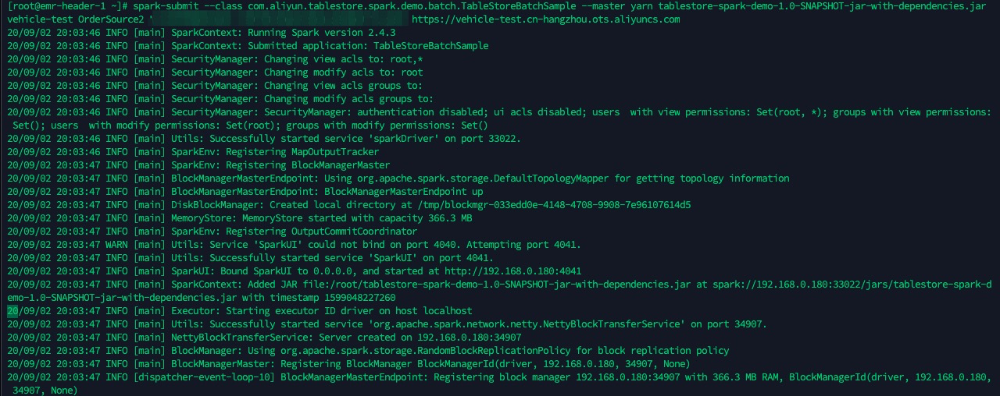

# Tablestore Spark Demo

## Prepare
You can just run below command, detail see at the shell script:
```shell
sh install.sh
```

Or, you can run the separate steps:

1.`cd TableStoreSparkDemo`

2.Install tablestore spark connector preview version: `2.2.0-SNAPSHOT`
> **Attention**: Later would support in stable maven version, e.g. 2.2.0

```
mvn install:install-file -Dfile=libs/emr-tablestore-2.2.0-SNAPSHOT.jar -DartifactId=emr-tablestore -DgroupId=com.aliyun.emr -Dversion=2.2.0-SNAPSHOT -Dpackaging=jar -DgeneratePom=true
```

## Provided examples
We prepared two categories: Batch and Structured streaming examples.

- Batch
    - TableStoreBatchSample: Quick start.
    - TableStoreSearchIndexSample: Spark With SearchIndex.
    - TableStoreSinkSample: Table copy via spark.
    
- Structured Streaming
    - StructuredTableStoreAggSample: Quick start with dataset functions.
    - StructuredTableStoreAggSQLSample: Quick start with streaming sql.
    - StructuredTableStoreSinkSample: An real time aggregate example, sink to Tablestore.

## Run sample
Assuming the sample code has been rewritten, e.g. `com.aliyun.tablestore.spark.demo.batch.TableStoreBatchSample`.

### Run in local IDE
1. In program arguements, fill contents with `<ots-instanceName> <ots-tableName> <access-key-id> <access-key-secret> <ots-endpoint>`
2. Selected `include dependencies with "provided" scope`.
3. Run the program.


                                            
### Run in spark cluster
1. Packaging: `mvn -U clean package`, package locate at `target/tablestore-spark-demo-1.0-SNAPSHOT-jar-with-dependencies.jar`.
2. Upload the package to driver node of spark cluster.
3. Run the program with `spark-submit`, e.g.

```
spark-submit --class com.aliyun.tablestore.spark.demo.batch.TableStoreBatchSample --master yarn tablestore-spark-demo-1.0-SNAPSHOT-jar-with-dependencies.jar <ots-instanceName> <ots-tableName> <access-key-id> <access-key-secret> <ots-endpoint>
```




